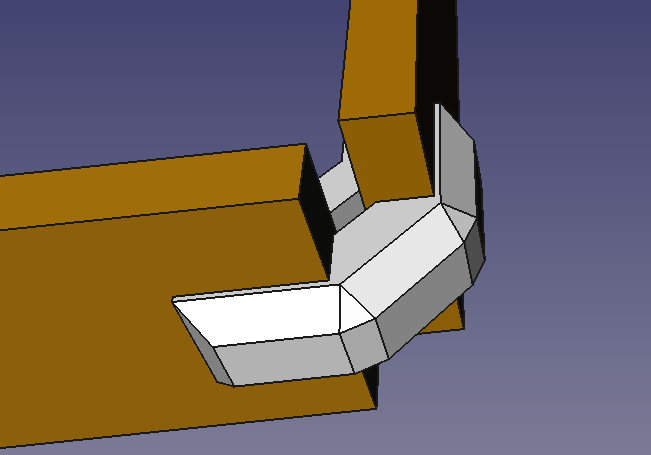
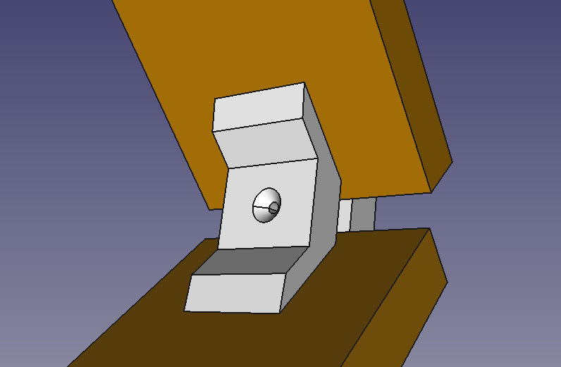
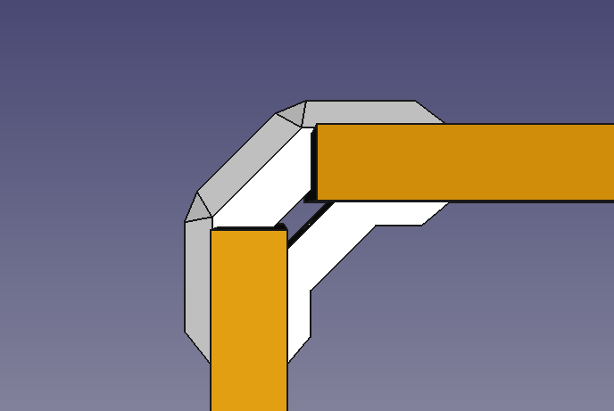
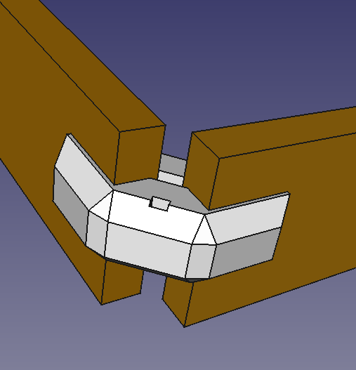

# Wood-connectors

3D printed wood connectors made in FreeCAD. Based on [this work](https://www.thingiverse.com/thing:3336116), [this work](https://cults3d.com/en/3d-model/home/90-degree-corner-joint-for-furniture) and [this work](https://www.playwood.it/en/ply-brackets/8-cross-connectors/#Technical-Information).

## Results

